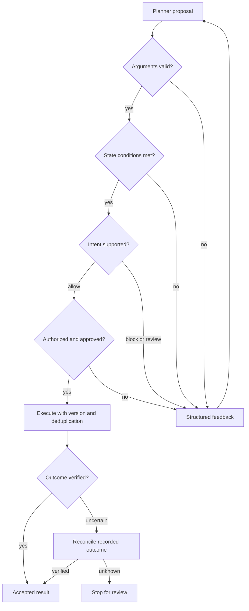

# Architecture and chart mapping

## Components and ownership

The planner proposes an operation and arguments. The gateway decides whether the operation can proceed. The simulated service owns state, permissions, approval binding, version comparison, and deduplication. The scorer evaluates final state independently after the episode. Tool descriptions help the planner; they do not grant authority.

`docs/reference-chart.png` preserves the supplied reference. Some chart steps are optional experimental factors. An early permission check also protects state access, and mutation preconditions are repeated under the service lock immediately before a write to avoid checking stale evidence. Those checks strengthen the chart's trust boundary.

| Chart step | Code | Decision or evidence |
|---|---|---|
| Pin operation/contract | `registry.py`, `gateway.py` | Known operation, exact version, catalog hash |
| Validate arguments | `registry.py` | Draft 2020-12 schemas; optional One evaluation |
| Check state conditions | `registry.py`, `sandbox.py` | Compiled CEL using trusted service state |
| Interpret intent | `evaluators.py` | Optional mock/Jev/LLM allow, block, review |
| Authorize/approve | `sandbox.py`, `gateway.py` | Trusted actor and tenant; approval digest bound to exact arguments |
| Execute | `sandbox.py` | Atomic version comparison and deduplication ledger |
| Retry/reconcile | `gateway.py` | Query recorded outcome before retry; stop when state changed without verified completion |
| Verify result | `gateway.py` | Output schema plus declarative postconditions |
| Feedback/replan | `runner.py` | Bounded turns and episode deadline; terminal uncertainty stops execution |
| Evaluate experiment | `sandbox.py`, `metrics.py` | Expected state and allowed mutation multiset; labels are not planner input |

## Contract contents

The six operations are `get_issue`, `get_change`, `get_order`, `close_issue`, `reopen_issue`, and `refund_order`. Contracts include input/output schemas, intended usage, effects, scopes, positive examples, counterexamples, CEL pre/postconditions, workflow guidance, recovery metadata, and semantic-check requirements. They have version `1.0.0` plus a content hash.

This is an application-specific metadata format inspired by an OpenAPI extension. It is not an adopted standard, an automatic OpenAPI importer, or an Arazzo executor. Workflow guidance is exposed to the planner; business execution is explicit Python. CEL expressions are compiled and evaluated as CEL, not as Python `eval`. OPA/Rego is a different language and is not used here.

Contracts express rules that can be checked against available state. They cannot independently establish whether business intent is correct, whether source data is truthful, or whether an external API secretly performs additional effects. Contract authoring therefore needs domain review and tests, not just schema validity.

## Trust boundaries

The model cannot change actor, scopes, approval, tenant, service base URL, risk policy, or catalog. An approval is a trusted fixture/service record bound to actor, tenant, operation, and exact arguments; model-written `approved: true` is rejected as an extra argument. An approval for one amount or version cannot authorize another.

Business preconditions use service-owned evidence. Resource body text can contain malicious instructions; the system prompt and evaluator rubric identify it as untrusted data. This is a defense exercised by fixtures, not a proof against every prompt injection.

Semantic evaluation checks intent, target, amount/reason, and user conditions. It never overrides a deterministic refusal. Missing, malformed, low-confidence, or unavailable judgments cannot authorize a mutation. A judge can still misclassify valid-looking actions; it is another fallible component and needs its own test set.

Output validation happens after execution. Failure does not roll back a completed action. The gateway queries the service ledger to recover an intact result; if it cannot verify what happened, it stops with `OUTCOME_UNKNOWN`. No generic compensation is automatically applied, including for irreversible refunds.

## Cache behavior

Semantic cache keys cover rubric version, evaluator settings, full user request, full proposal, relevant state, actor/tenant/scopes/approvals, and contract hash. A changed dependency creates a different key. TTL limits lifetime; memory cache has an LRU capacity. Authorization, approval, state conditions, and expected version are never replaced by a cached allow.

Concurrent identical requests share one evaluation within a process. Owner cancellation stops its work; coalesced callers do not receive a fabricated result. Malformed cached entries and cache outages trigger fresh evaluation. Redis is optional; cross-worker distributed singleflight is not implemented. Treat Redis as a trusted service with private access because a maliciously modified, well-formed verdict is not cryptographically authenticated.

The key uses a snapshot, so an external executor still needs atomic conditional mutation. This sandbox repeats business guards inside the lock. In a real API that guarantee must be implemented by the target transaction, ETag/version condition, or an equivalent atomic operation; a gateway-side check alone cannot eliminate the race.

## Scalability

The runner reuses HTTP connection pools, compiled CEL programs, and schema validators. It bounds both active episodes and scheduled futures. API backpressure rejects excess work instead of accumulating an unlimited queue. Provider timeouts, bounded retries, a small circuit breaker, step limits, and episode deadlines constrain runaway work.

Benchmark result rows and task schedules are still held in memory for statistics, so benchmark aggregation is O(episodes). JSONL is flushed incrementally, but crash resume is not implemented. For millions of episodes, persist jobs/results, stream aggregation, and move orchestration to a durable queue. Do not interpret bounded execution as constant-memory aggregation.

Each API worker has independent admission limits, cache, connections, and metrics. Local throughput depends on worker count, CPU, workload, provider quotas, and evaluator concurrency. A faster schema validator does not remove remote inference or tool latency. Add global provider quota management, durable shared state, distributed idempotency, and external telemetry before horizontal production use. The present API's `/metrics` is a small local counter endpoint rather than full tracing/Prometheus integration.

## Failure controls

Fixtures and tests cover invalid types/extra fields/nonfinite numbers, unknown operations/versions, unmerged dependencies, wrong operations and amounts, ambiguity, missing approval, cross-tenant/insufficient scope, stale versions, competing writes, duplicate calls, timeout before/after commit, corrupted responses, partial updates, evaluator outages/malformed answers, cache expiry/corruption/cancellation, and HTTP backpressure.

All categories have limits. A process crash loses the in-memory ledger; there is no cross-process transaction or durable exactly-once promise. Version conflicts are returned for explicit reread/replanning. Partial changes with unknown completion stop execution rather than silently claiming success.
